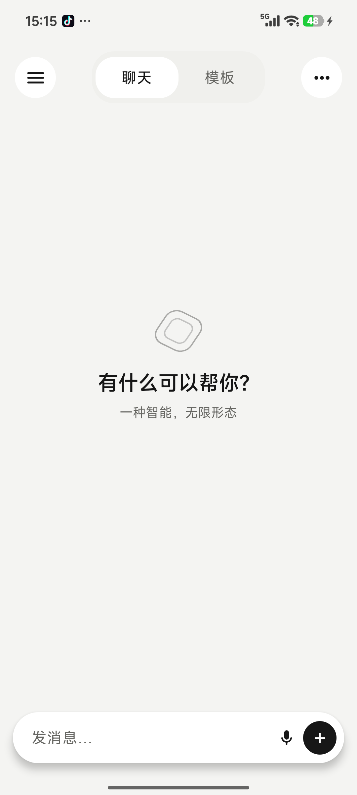
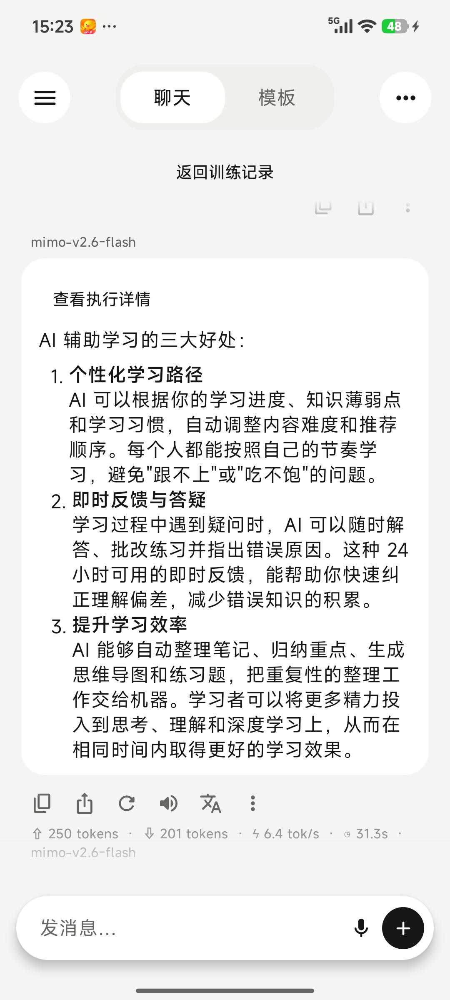
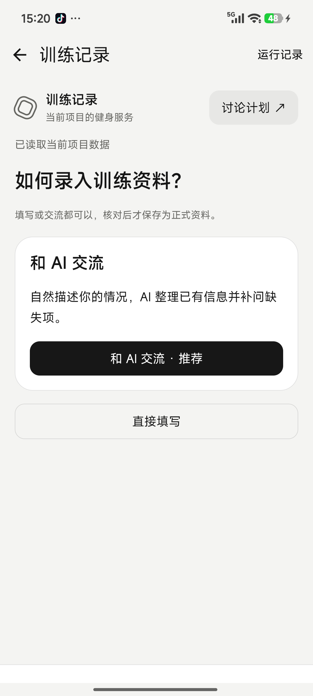

<div align="center">

# MutCube

**面向 Android 的开源 AI 客户端与可编程 AI 服务容器**

多模型聊天 · AI 项目与记忆 · Agent Skills · MCP · 模板服务 · 语音 · 加密备份

> 一种智能，无限形态。

[English](README_EN.md) · 简体中文


</div>

MutCube 是一个使用 Kotlin 与 Jetpack Compose 开发的原生 Android AI 应用。它既是支持多家大模型供应商的
LLM 聊天客户端，也是承载项目上下文、长期记忆、Agent Skills、MCP 工具和可视化模板服务的 AI 宿主。

MutCube 的目标不是把所有能力都塞进聊天气泡，而是让同一个 AI 根据任务切换不同的交互形态：需要开放式讨论时
使用聊天，需要稳定业务流程和结构化数据时使用模板，需要可复用工作方法时使用 Skill，需要外部能力时使用 MCP。

## 当前状态

MutCube 正处于积极开发阶段，当前应用版本为 **0.1.3**，包名为 `com.dwl.mutcube`，最低支持 Android 8.0
（API 26）。核心聊天、项目、记忆、Provider、Skill、MCP、备份以及内置模板闭环已经实现，但界面、协议和数据结构
在正式稳定版之前仍可能调整。

项目不内置任何商业模型的 API Key 或免费额度。使用云端模型、语音服务、MCP、WebDAV 或 S3 时，需要用户自行提供
相应服务和凭据。

2026-10-08 已完成一轮可靠性修复、职责拆分与开源准备；实际测试结果及未验证事项见
[审查记录](docs/OPEN_SOURCE_READINESS_AUDIT.md)。文档入口见 [文档导航](docs/README.md)。

## 为什么是 MutCube

普通 AI 客户端主要围绕“对话”组织功能。MutCube 在对话之外增加了三类互补能力：

- **项目（Project）**：组织相关会话、项目指令、模型偏好、记忆和模板服务；普通会话仍可独立存在。
- **Skill**：符合 Agent Skills 结构的可复用工作流程，可自动匹配或由用户在输入框中手动选择。
- **模板（Template）**：具有 GUI、Action、结构化数据和权限边界的 AI 服务；模板交互不会伪装成普通聊天消息。

以训练记录模板为例，表单和日历负责高效操作，AI 负责整理资料与生成候选训练计划，宿主负责权限、结构校验、版本
确认和持久化。项目聊天也可以在授权范围内发现并调用同一组模板能力。

## 界面预览

以下为 Android 真机实拍，展示空白首页、真实 AI 回复和内置健身模板；不是 HTML 原型。

| 首页 | AI 对话 | 健身模板 |
| --- | --- | --- |
|  |  |  |

[查看全部 10 张截图及拍摄说明](docs/screenshots/README.md)。

## 主要功能

### 多模型 AI 聊天

- OpenAI Chat Completions 兼容协议，以及 Google Generative Language、Anthropic Messages 原生协议。
- 内置 Xiaomi MiMo、OpenAI、Google Gemini、Anthropic Claude、DeepSeek、硅基流动、OpenRouter、阿里云百炼、
  火山引擎、智谱 AI、月之暗面等可编辑 Provider 预设，也支持自定义 HTTPS 地址和模型 ID。
- Provider 启停、拖动排序、模型发现、连接诊断、模型别名/图标/收藏及图片、工具、推理、上下文窗口等能力声明。
- 流式回复、停止生成、失败重试、重新生成、编辑后分支、候选切换以及会话级系统提示词。
- Token、缓存 Token、生成速度和耗时统计；开发者模式下提供脱敏请求日志与错误详情。
- Markdown 正文、代码、列表和表格渲染；宽表格可以局部横向滚动，回复文本支持系统选区与复制。

### 会话、项目、上下文与记忆

- 会话重命名、置顶、搜索、软删除与撤销、收藏、分享、导出及历史分支。
- 会话可加入、移动或移出项目；项目可配置独立 Provider、模型参数、系统指令和上下文策略。
- 项目内跨会话历史检索，结果附带来源；无项目会话不会获得其他项目的数据。
- 长会话在达到消息或上下文阈值时创建压缩检查点，原始消息仍完整保存在本地数据库。
- 全局/项目长期记忆支持查看、编辑、删除和来源范围；AI 写入记忆需要用户显式开启。
- 快捷提示词、对话模式、关键词知识条目以及 AI 后续问题建议。

### 多模态、语音与消息工具

- 支持图片、文本、PDF、音频和视频附件；长文本粘贴可自动转为私有 TXT 附件。
- 图片缩略图预览、附件增删、系统分享内容进入聊天草稿。
- 系统 TTS/ASR，以及通过已配置 OpenAI-compatible Provider 使用独立语音模型；支持可选音色、流式朗读和实时录音波形。
- 消息复制、部分文字选择、分享、翻译、朗读/停止、收藏和生成统计。
- 后台生成与完成通知可选，锁屏通知不显示会话正文。

### Agent Skills 与 MCP

- 导入、创建、导出、搜索和卸载符合 Agent Skills 目录结构的 Skill ZIP。
- Skill 支持自动、手动、停用三种调用模式，以及全局或指定项目作用域。
- 对 Skill 正文进行按需选择，展示版本、来源和许可，并保留基础选择与调用审计。
- 当前 Android 版本会读取 `SKILL.md` 和文本参考资源，但**不会执行 Skill 中附带的脚本**。
- MCP Streamable HTTP 服务管理、Bearer 凭据、OAuth 2.0、工具发现和逐工具启停。
- 外部工具调用支持询问、允许或拒绝，并保留调用状态；凭据不会写入聊天、日志或备份。

### 模板服务系统

- 模板与项目绑定，而不是与某一条会话绑定；当前一个项目最多绑定一个模板。
- 模板 GUI 与项目聊天共用声明式 Action 引擎，宿主注入项目身份并执行权限检查。
- 模板声明数据集合和 JSON 契约，Room 数据库由宿主统一提供，数据归用户而不是模板所有。
- AI 运行作为隐藏的 `TemplateRun` 保存输入、状态、上下文快照和脱敏错误，不污染普通会话列表。
- AI 生成候选版本，用户确认后切换当前版本；历史事实默认不可覆盖。
- 当前随应用提供“训练记录”内置模板，包含资料录入/AI 整理、当天训练、实际记录、计划候选和日历历史。
- 支持本地导入 `.mutcube-template` 模板包：安装前校验资源 Hash、展示权限，绑定项目后授权运行；提供浏览器 SDK、Mock Host、打包工具，以英语学习模板作为官方开发样板，另有训练与语音专项示例。
- 第三方包目前来源未验证；尚无开发者签名、模板市场或自动更新。敏感宿主能力仅开放经明确声明和限制的子集。

模板架构请阅读 [模板模块说明](docs/TEMPLATE_MODULES.md)，内置模板开发可参考
[模板开发说明](docs/TEMPLATE_DEVELOPMENT_GUIDE.md)，第三方开发见 [模板包 v1 规范](docs/TEMPLATE_PACKAGE_V1.md) 与 [Template SDK](template-sdk/README.md)。

### 内置健身模板：训练记录与 AI 计划

“训练记录”是随 App 提供的健身模板，无需另行导入。它将训练资料、计划、实际成绩和日历历史放在同一个项目中，展示模板 GUI 与 AI 聊天如何通过宿主的声明式能力协作。

- **基础资料**：直接填写，或通过与 AI 交流整理后核对保存；包括身高、体重、训练目标、频率与分化，训练经验、器械、限制及熟悉动作的工作重量可选。
- **训练计划**：AI 根据正式资料、当前计划和最近训练生成候选；还可受控检索同项目其他会话作为参考。预览动作、建议重量、组数、次数区间及 RIR 后，点击启用才成为当前计划，不自动把聊天内容当作训练事实。
- **实际训练**：预填建议重量和组数，逐组录入实际次数与 RIR（剩余可完成次数），支持调整重量、增减组数、临时移除动作和填写备注；草稿自动保存，离开时检查保存状态。
- **提交与后续安排**：先持久化实际记录，再请求 AI 生成下一次计划；生成失败不会丢失已提交成绩，可单独重试。已完成计划不再自动作为次日待填内容，下一候选需手动启用。
- **日历与项目聊天**：日历标记已提交日期并展示当天计划快照与成绩；同项目聊天可按授权查询训练历史，或提出调整计划的要求，生成新候选后回模板预览启用。

使用流程：**打开模板并绑定项目 → 保存基础资料 → 生成、预览并启用计划 → 记录训练 → 提交成绩 → 查看并启用下一计划**。首次绑定需要授权，绑定保留时再次进入无需重复确认。AI 功能需要配置可用的 Provider、模型与 API Key。

当前每个自然日只支持一份实际训练记录，不支持同日多场次；聊天不能直接覆盖历史成绩或启用计划。AI 建议可能出错，不替代专业指导或医疗建议。详细状态、权限与数据边界见 [健身模板流程说明](docs/FITNESS_SERVICE_V2.md)。英语学习模板仍是第三方 SDK 的官方开发样板，健身模板用于展示内置服务的完整业务流程。

### 数据、安全与备份

- Room 本地数据库保存会话、项目、记忆、模板记录和执行信息。
- API Key、OAuth Token 和远程存储密钥通过 Android Keystore + AES-GCM 加密保存。
- 本地备份支持带校验清单的 ZIP，或使用密码生成 PBKDF2 + AES-256-GCM 加密的 `.mutcube` 文件。
- 支持 WebDAV 与 S3 远程备份、恢复前预览与完整性校验、7/14/30 天备份提醒。
- API Key 和其他凭据永不进入备份；新设备恢复后需要重新填写凭据并重新确认高风险授权。
- 存储管理、缓存清理、安全诊断、第三方依赖许可和版本更新检查。

详细备份边界见 [数据备份与恢复](docs/DATA_BACKUP.md)。

## 快速开始

1. 安装 MutCube 后，进入“设置 → 模型服务”。
2. 启用一个 Provider，填写 API Key，并从服务端获取模型或手动添加模型 ID。
3. 在连接诊断通过后，将模型设为默认模型。
4. 返回首页新建聊天；只有实际发送内容的会话才会进入最近列表。
5. 如需跨会话上下文，可创建项目并把会话移入项目。
6. 如需结构化服务，可在模板页将内置模板绑定到项目；如需复用工作流，可在 Skill 管理中导入标准 Skill。

> [!IMPORTANT]
> 云端模型会接收到你主动发送的消息、附件正文以及为当前请求选中的项目上下文。请根据所选 Provider 的隐私政策
> 决定是否发送敏感信息。MutCube 的本地加密不能替代云端服务自身的数据处理政策。

## 下载与构建

源码仓库不提交 APK。可安装的预发布版本请从 [GitHub Releases](https://github.com/damonwl/MutCube/releases) 下载，并查看 [v0.1.3 发布说明](docs/releases/v0.1.3.md) 和随包校验文件。也可从源码自行构建；不要从不明来源下载带有 MutCube 名称的 APK。

构建环境：

- Android Studio（建议使用支持 AGP 9.3.1 的版本）
- JDK 17
- Android SDK 37

```bash
git clone https://gitee.com/wlwanglei/mutcube.git
cd mutcube

# Debug 包：app/build/outputs/apk/debug/
./gradlew :app:assembleDebug

# 使用独立包名和开发签名的本地验收包
./gradlew :app:assembleAlpha

# 单元测试与静态检查
./gradlew test
./gradlew :app:lintDebug

# 需要已启动模拟器或已连接设备
./gradlew :core:database:connectedDebugAndroidTest
```

`alpha` 使用开发签名与 `com.dwl.mutcube.alpha` 包名，只适合本地测试。正式分发需要自行配置并妥善保管发布签名。

## 项目结构

```text
app/                Android 入口、Compose UI、设置与依赖组装
core/model/         领域模型与跨模块契约
core/database/      Room、DAO、Repository 与数据库迁移
core/ai/            模型协议、流式响应、工具调用与 Provider 预设
core/context/       项目历史检索与附件正文提取
core/security/      Android Keystore 凭据存储
core/extensions/    MCP 等宿主扩展契约
feature/chat/       上下文组装、生成、工具循环与消息持久化
template/core/      模板协议 2、Manifest、Action 与契约校验
template/runtime/   授权 CRUD、AI 运行、摘要与宿主适配
template/builtin/   内置模板声明
template/ui/        安全 WebView、原生确认与运行记录
docs/               架构、数据、验收和开发文档
```

总体设计见 [架构文档](docs/ARCHITECTURE.md)，上下文与记忆边界见
[上下文与记忆设计](docs/CONTEXT_AND_MEMORY.md)，当前实现证据见
[功能完成审计](docs/FEATURE_COMPLETION_AUDIT.md) 和 [开发进度](docs/PROGRESS.md)。

## 已知边界与路线图

- 第三方模板已支持本地导入、授权数据操作及配置后的 Provider TTS/ASR；签名认证、模板市场、自动更新以及相机/通知/日历等宿主能力尚未实现。
- Skill 脚本执行环境、远程 Skill 仓库与自动更新尚未开放。
- 项目历史检索目前以本地关键词和有限窗口为主，不等同于完整向量知识库。
- PDF、扫描件、音频和视频可以作为附件保存与分享，但并非所有格式都已实现正文理解；界面不会把未解析内容伪装成已解析。
- WebDAV/S3 是用户主动控制的备份与恢复，不是多设备实时同步或账号云同步。
- 当前主要面向中文界面，README 提供中英文版本；应用本地化仍在完善。

完整目标和阶段边界记录在 [`docs/`](docs/) 中。欢迎围绕缺陷修复、测试、文档、兼容性和清晰边界的功能实现提交贡献。

贡献流程与完整检查命令见 [CONTRIBUTING.md](CONTRIBUTING.md)，安全报告规则见 [SECURITY.md](SECURITY.md)。
GitHub CI 不需要 API Key，不调用真实模型服务；SDK 和开发文档直接保存在源码中，无需发布 npm 包。

## 贡献指南

1. Fork 仓库并从当前主分支创建功能分支。
2. 修改前阅读 [代码来源与许可证策略](docs/ORIGIN_POLICY.md) 和 [开源复用流程](docs/OPEN_SOURCE_REUSE.md)。
3. 不要提交 API Key、签名文件、用户备份、真实聊天或其他敏感数据。
4. 为新逻辑补充相应测试，并至少运行受影响模块测试与 Lint。
5. Pull Request 请说明问题、方案、验证方式、界面变化和第三方依赖许可。

MutCube 允许使用许可证兼容的成熟组件，但不会复制或机械翻译许可证不兼容项目的实现代码。

## 开源协议与商标

源代码依据 [MIT License](LICENSE) 开放。第三方依赖仍适用各自的许可证，应用内可以查看相应许可信息。

“MutCube”名称和项目 Logo 是项目的品牌标识。MIT License 授予的是软件版权许可，不自动授予名称、Logo 或其他
商标标识的使用权。
