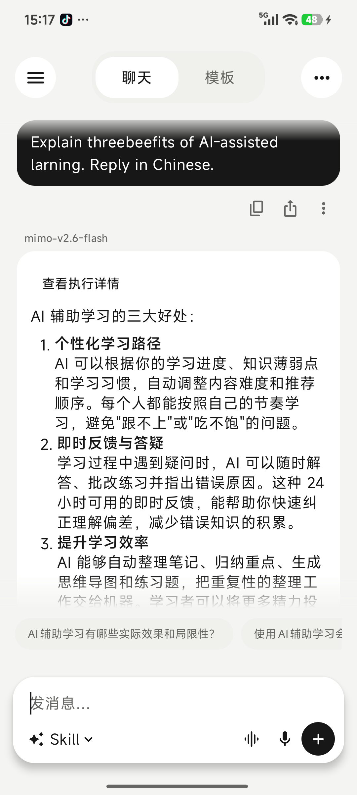
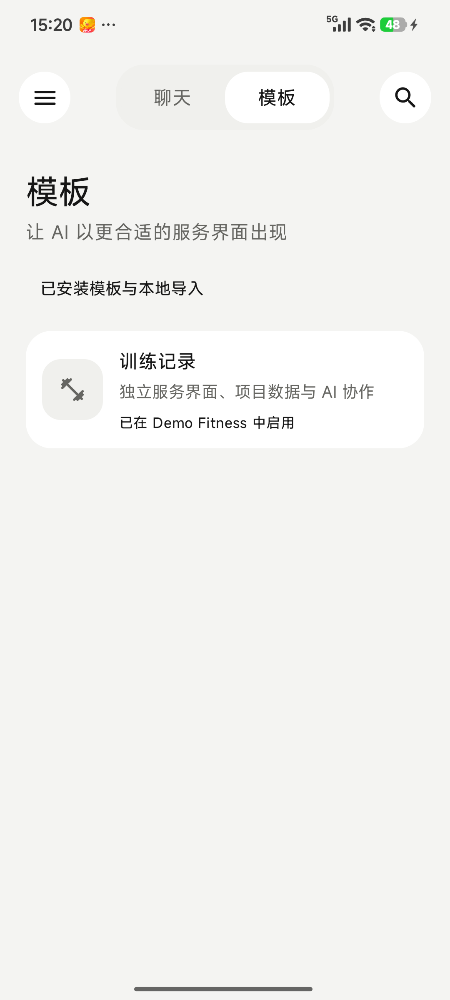
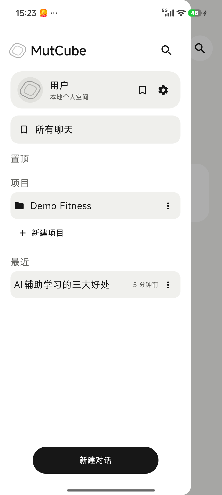
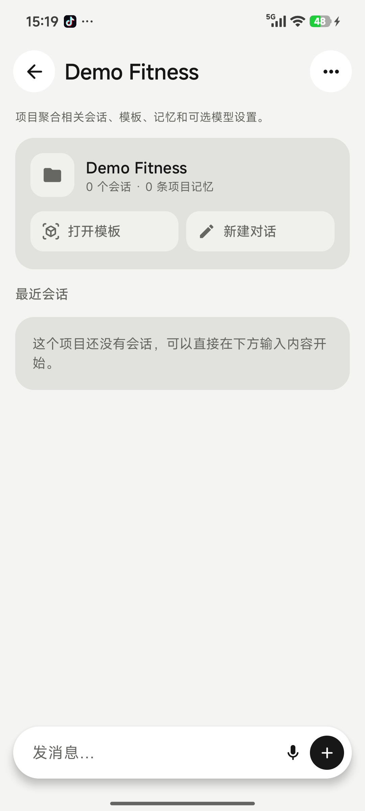
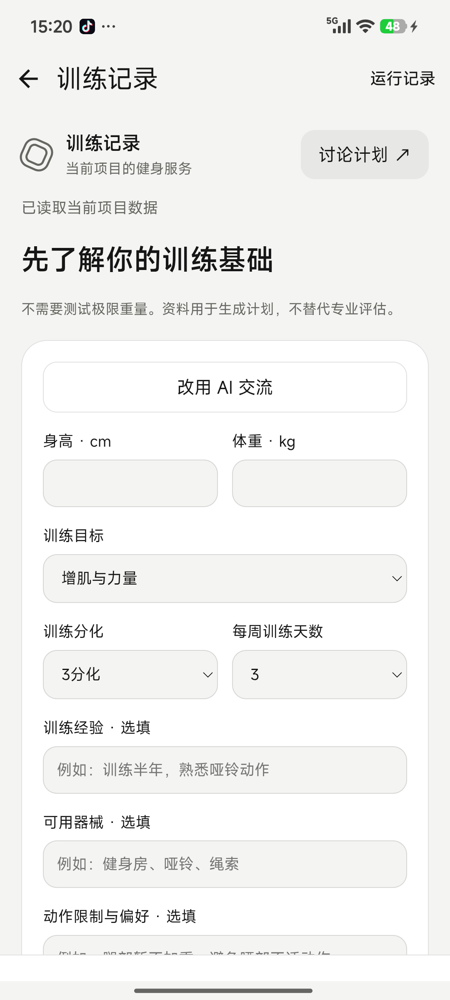
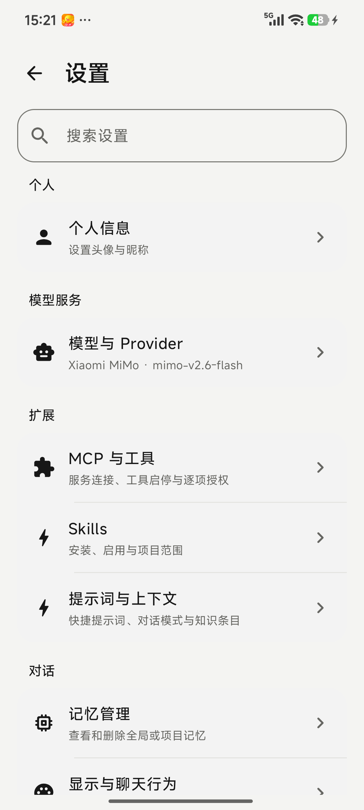
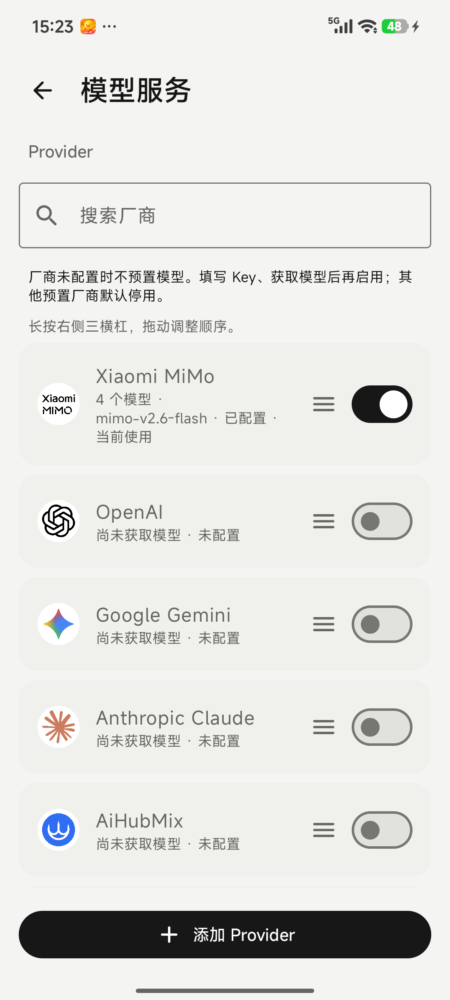

# MutCube 真机界面 / Device screenshots

拍摄日期：2026-10-08。设备：Xiaomi 24122RKC7C，Android 16；应用：MutCube 0.1.3 Debug，浅色主题。图片为 1080 × 2400 原始 PNG，未使用原型或生成式图片。

Captured on a Xiaomi 24122RKC7C running Android 16, using MutCube 0.1.3 Debug in light mode. All images are original 1080 × 2400 device captures, not mockups or generated images.

## 界面图集 / Gallery

| 首页 / Home | 对话输入 / Chat composer |
| --- | --- |
|  |  |

| AI 回复 / AI response | 模板目录 / Templates |
| --- | --- |
|  |  |

| 侧边栏 / Sidebar | 项目详情 / Project |
| --- | --- |
|  |  |

| 健身录入入口 / Fitness intake | 基础资料表单 / Profile form |
| --- | --- |
|  |  |

| 设置 / Settings | 模型服务 / Providers |
| --- | --- |
|  |  |

## 拍摄范围 / Scope

- AI 回复来自真机已配置的 Xiaomi MiMo `mimo-v2.6-flash`，主题是 AI 辅助学习的好处；不是预填回复。输入通过电脑键盘完成，输入法造成的英文拼写误差保留在原图中。
- `Demo Fitness` 是为拍摄新建的演示项目；只展示训练模板首次进入和空白资料表单，没有保存虚构身高、体重或训练成绩。
- 仅拍摄不含凭据和私人内容的界面，不包含 API Key、键盘剪贴板、原始请求日志或备份文件。
- 本图集用于说明界面，不等同于完整功能验收；没有展示所有模板页、深色主题或 Release APK 的重新安装测试。

The response was generated by the configured Xiaomi MiMo model, not inserted as sample text. `Demo Fitness` was created for these captures; no fictional profile or workout results were saved. Credentials, keyboard clipboard contents, private chats, raw request logs, and backup files are excluded. These images illustrate the UI and do not constitute complete functional acceptance or a fresh installation test of the release APK.
